# ⚡ AIPlanX — AI Employee Management System

> An AI-powered, browser-based project planning system that reads **CSV inputs** and automatically generates task breakdowns, team assignments, dependency graphs, and Gantt timelines.

---

## 📋 Table of Contents

1. [Overview](#overview)
2. [Features](#features)
3. [Getting Started](#getting-started)
4. [CSV Input Formats](#csv-input-formats)
5. [Task Breakdown Model](#task-breakdown-model)
6. [Dependency Graph](#dependency-graph)
7. [Team Assignment Algorithm](#team-assignment-algorithm)
8. [File Structure](#file-structure)

---

## Overview

AIPlanX accepts **project descriptions** and **employee data** as CSV files, then uses an AI planning engine to:

- Break every project into 5 standard phases
- Assign the best-fit employees based on skills + workload
- Render an interactive dependency graph of all tasks
- Generate a Gantt timeline with day-accurate estimates
- Display a team workload dashboard with charts

No backend required — runs entirely in the browser.

---

## Features

| Feature | Description |
|---|---|
| 📂 Smart CSV Upload | Drop any CSV files; auto-detected by column headers |
| 🧠 AI Task Planner | Auto-decomposes projects into 5 phases with time estimates |
| 👥 Team Matcher | Skill-based assignment with workload balancing |
| 🔗 Dependency Graph | Interactive D3.js force-directed DAG with zoom & tooltips |
| 📅 Gantt Timeline | Horizontal phase bars per project |
| 📊 Charts | Team workload bar chart + priority distribution doughnut |
| 📜 History Insights | Past project success scores and team-size analytics |

---

## Getting Started

### 1. Start a local server

```bash
# Python (recommended)
python -m http.server 8080 --directory "path/to/emp"
```

### 2. Open in browser

```
http://localhost:8080
```

### 3. Upload CSVs

- Click **"📂 Upload CSVs"** → drag-and-drop or browse your CSV files  
- The system auto-detects each file type from its column headers  
- Minimum required: **projects.csv** + **employees.csv**  
- Click **"⚡ Load Sample Data"** to try the built-in demo instantly

### 4. Generate Plan

Click **"🤖 Generate AI Plan"** — all pages populate automatically.

---

## CSV Input Formats

### `projects.csv` *(required)*

| Column | Type | Description |
|---|---|---|
| `project_id` | string | Unique project identifier (e.g. `PRJ001`) |
| `project_name` | string | Short project name |
| `description` | string | Full project description |
| `required_skills` | string | Semicolon-separated skills (e.g. `Python;ML;NLP`) |
| `deadline_days` | integer | Days available to complete |
| `priority` | string | `High` / `Medium` / `Low` |

### `employees.csv` *(required)*

| Column | Type | Description |
|---|---|---|
| `employee_id` | string | Unique employee ID (e.g. `EMP001`) |
| `employee_name` | string | Full name |
| `role` | string | Job title / role |
| `skills` | string | Semicolon-separated skills |
| `experience` | integer | Years of experience |
| `current_workload_percent` | integer | Current workload 0–100 |

### `project_history.csv` *(optional)*

| Column | Type | Description |
|---|---|---|
| `history_id` | string | Unique history record ID |
| `project_id` | string | Reference project ID |
| `project_name` | string | Project name |
| `team_size` | integer | Number of team members |
| `tools_used` | string | Semicolon-separated tools |
| `completion_days` | integer | Actual days taken |
| `success_score` | float | Score 0.0 – 1.0 |

### `tools.csv` *(optional)*

| Column | Type | Description |
|---|---|---|
| `tool_id` | string | Unique tool ID |
| `tool_name` | string | Tool name |
| `tool_type` | string | Category (e.g. LLM API, Database) |
| `purpose` | string | What the tool is used for |

> **Note:** File names don't matter — the system detects type from column headers automatically. If a file can't be auto-detected, a manual type selector appears.

---

## Task Breakdown Model

Every project is broken into **5 sequential phases**. Estimated days per phase are calculated using:

```
phase_days = max(2, round(deadline_days × phase_weight × complexity_factor))
```

**Complexity Factor** is derived from:
- Number of required skills (more skills → higher complexity)
- Deadline tightness (shorter deadline → higher complexity)
- Priority level (`High` adds 0.2 multiplier)

### Phase Definitions

| # | Phase | Weight | Icon | Description |
|---|---|---|---|---|
| 1 | **Research & Analysis** | 15% | 🔍 | Understand requirements, study domain, gather data |
| 2 | **System Design** | 15% | 🎨 | Architecture, schema design, API contracts |
| 3 | **Development** | 45% | 💻 | Core implementation, feature building, integration |
| 4 | **Testing & QA** | 15% | 🧪 | Unit tests, integration tests, bug fixes |
| 5 | **Deployment & Handoff** | 10% | 🚀 | CI/CD pipeline, staging, production release |

### Example: AI Sales Assistant (30-day deadline, High priority)

| Task ID | Phase | Est. Days | Timeline | Depends On |
|---|---|---|---|---|
| PRJ001-T01 | 🔍 Research & Analysis | 7d | Day 1 → Day 7 | — (Start) |
| PRJ001-T02 | 🎨 System Design | 7d | Day 8 → Day 14 | PRJ001-T01 |
| PRJ001-T03 | 💻 Development | 22d | Day 15 → Day 36 | PRJ001-T02 |
| PRJ001-T04 | 🧪 Testing & QA | 7d | Day 37 → Day 43 | PRJ001-T03 |
| PRJ001-T05 | 🚀 Deployment & Handoff | 4d | Day 44 → Day 47 | PRJ001-T04 |

---

## Dependency Graph

Each project produces a **linear task chain** (DAG — Directed Acyclic Graph). Tasks must be completed in order; no task can start until its predecessor is done.

```mermaid
flowchart LR
    subgraph PRJ001["📁 AI Sales Assistant"]
        A1["🔍 Research\n7d"]
        A2["🎨 Design\n7d"]
        A3["💻 Development\n22d"]
        A4["🧪 Testing\n7d"]
        A5["🚀 Deployment\n4d"]
        A1 --> A2 --> A3 --> A4 --> A5
    end

    subgraph PRJ002["📁 Healthcare Predictor"]
        B1["🔍 Research\n10d"]
        B2["🎨 Design\n10d"]
        B3["💻 Development\n30d"]
        B4["🧪 Testing\n10d"]
        B5["🚀 Deployment\n5d"]
        B1 --> B2 --> B3 --> B4 --> B5
    end

    subgraph PRJ003["📁 Customer AI Chatbot"]
        C1["🔍 Research\n6d"]
        C2["🎨 Design\n6d"]
        C3["💻 Development\n16d"]
        C4["🧪 Testing\n6d"]
        C5["🚀 Deployment\n4d"]
        C1 --> C2 --> C3 --> C4 --> C5
    end

    subgraph PRJ004["📁 Smart Inventory"]
        D1["🔍 Research\n8d"]
        D2["🎨 Design\n8d"]
        D3["💻 Development\n25d"]
        D4["🧪 Testing\n8d"]
        D5["🚀 Deployment\n5d"]
        D1 --> D2 --> D3 --> D4 --> D5
    end

    style A1 fill:#818cf822,stroke:#818cf8,color:#818cf8
    style A2 fill:#a78bfa22,stroke:#a78bfa,color:#a78bfa
    style A3 fill:#4f9cf922,stroke:#4f9cf9,color:#4f9cf9
    style A4 fill:#34d39922,stroke:#34d399,color:#34d399
    style A5 fill:#fb923c22,stroke:#fb923c,color:#fb923c
    style B1 fill:#818cf822,stroke:#818cf8,color:#818cf8
    style B2 fill:#a78bfa22,stroke:#a78bfa,color:#a78bfa
    style B3 fill:#4f9cf922,stroke:#4f9cf9,color:#4f9cf9
    style B4 fill:#34d39922,stroke:#34d399,color:#34d399
    style B5 fill:#fb923c22,stroke:#fb923c,color:#fb923c
    style C1 fill:#818cf822,stroke:#818cf8,color:#818cf8
    style C2 fill:#a78bfa22,stroke:#a78bfa,color:#a78bfa
    style C3 fill:#4f9cf922,stroke:#4f9cf9,color:#4f9cf9
    style C4 fill:#34d39922,stroke:#34d399,color:#34d399
    style C5 fill:#fb923c22,stroke:#fb923c,color:#fb923c
    style D1 fill:#818cf822,stroke:#818cf8,color:#818cf8
    style D2 fill:#a78bfa22,stroke:#a78bfa,color:#a78bfa
    style D3 fill:#4f9cf922,stroke:#4f9cf9,color:#4f9cf9
    style D4 fill:#34d39922,stroke:#34d399,color:#34d399
    style D5 fill:#fb923c22,stroke:#fb923c,color:#fb923c
```



### Node Color Legend

| Color | Phase |
|---|---|
| 🟣 Purple `#818cf8` | Research & Analysis |
| 🟣 Violet `#a78bfa` | System Design |
| 🔵 Blue `#4f9cf9` | Development |
| 🟢 Green `#34d399` | Testing & QA |
| 🟠 Orange `#fb923c` | Deployment & Handoff |

### Dependency Rules

```
T01 (Research)   → no dependencies          [START]
T02 (Design)     → depends on T01
T03 (Development)→ depends on T02
T04 (Testing)    → depends on T03
T05 (Deployment) → depends on T04           [END]
```

> In the interactive app, the dependency graph is a **force-directed D3.js visualization** where nodes are draggable, zoomable, and show tooltips with task details on hover.

---

## Team Assignment Algorithm

For each project, employees are scored and ranked:

```
total_score = (skill_match × 0.65) + ((1 − workload) × 0.25) + (experience_bonus × 0.10)
```

- **skill_match** — fraction of required skills matched (0.0 – 1.0)
- **workload** — normalized current workload (0.0 – 1.0)
- **experience_bonus** — capped at 7 years, normalized to 0.0 – 0.2

Top-N employees (based on project skill count) are assigned. Each assigned member gets +12% workload added, which is carried forward when planning subsequent projects (preventing overloading).

---

## File Structure

```
emp/
├── index.html              # Main app shell
├── styles.css              # Dark glassmorphism design system
├── app.js                  # AI planning engine + renderers
├── employees.csv           # Sample employee data (10 records)
├── projects.csv            # Sample project data (6 records)
├── project_history.csv     # Sample history data (6 records)
├── tools.csv               # Sample tools catalog (10 records)
└── README.md               # This file
```

### Technology Stack

| Library | Version | Purpose |
|---|---|---|
| [PapaParse](https://www.papaparse.com/) | 5.4.1 | CSV parsing (with BOM support) |
| [D3.js](https://d3js.org/) | v7 | Force-directed dependency graph |
| [Chart.js](https://www.chartjs.org/) | 4.4.0 | Workload bar + priority doughnut charts |
| Google Fonts — Inter | — | UI typography |
| Google Fonts — Fira Code | — | Monospace labels |

---

## License

MIT — free to use, modify, and distribute.
